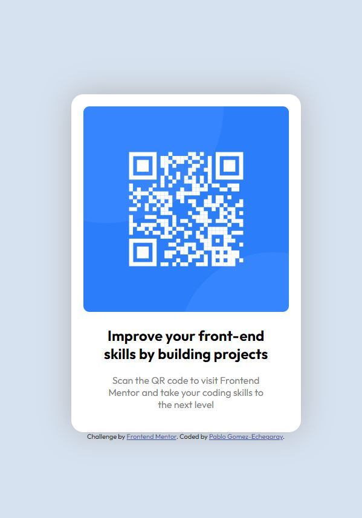

# Frontend Mentor - QR code component solution

This is a solution to the [QR code component challenge on Frontend Mentor](https://www.frontendmentor.io/challenges/qr-code-component-iux_sIO_H). Frontend Mentor challenges help you improve your coding skills by building realistic projects.

## Table of contents

- [Overview](#overview)
  - [Screenshot](#screenshot)
  - [Links](#links)
- [My process](#my-process)
  - [Built with](#built-with)
  - [What I learned](#what-i-learned)
  - [Continued development](#continued-development)
  - [Useful resources](#useful-resources)
- [Author](#author)
- [Acknowledgments](#acknowledgments)

## Overview

A QR Code Component.

### Screenshot

### Links

- Live Site URL: [Add live site URL here](https://657cffa68ccef35f5c962d69--wondrous-otter-cad76d.netlify.app/)

## My process

First, I outlined in my mind the structure of the elements. I saw a rounded and centered card component with a rounded image and centered text below.
Second, I layed out the html for each of the elements. A outer card div, with an image and a div to contain the header h2 and paragraph below.
Third, I applied the styles starting with the body. I adjusted the background color, height, and set display to flex. Then I rounded the borders of the img and card div while applying a light shadow. Finally, I change the img size and fonts to match the design specifications.

### Built with

- Semantic HTML5 markup
- CSS custom properties
- Flexbox
- Mobile-first workflow

### What I learned

This was a fun practice problem. I had to look up the box-shadow arguments.

### Continued development

I didn't know how to set the footer to stay at the bottom without messing the rest of it up.

### Useful resources

mdn docs

## Author

Pablo Gomez-Echegaray
